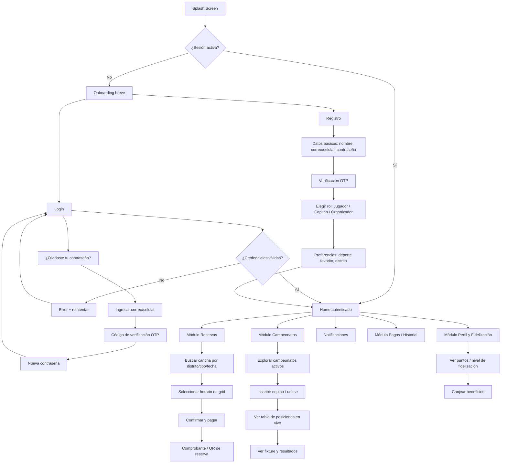

# CanchaMatch — Consolidación del Alcance del Proyecto

**Fecha:** 30 de agosto de 2026
**Proyecto:** CanchaMatch — Plataforma Integral de Gestión para Complejos Deportivos y Campeonatos
**Stack:** Jetpack Compose (panel admin) · Flutter (app cliente) · Antigravity IDE · GitHub (control de versiones)

---

## 1. Investigación y Benchmarking

Se analizaron cinco referentes directos e indirectos del rubro: dos plataformas globales de reserva/gestión deportiva, una app peruana de reserva de canchas, y las apps especializadas en organización de torneos y ligas amateur. El objetivo fue identificar qué problemas resuelven, qué funcionalidades cubren y qué prácticas de UX/UI conviene adaptar a CanchaMatch.

### 1.1 Cuadro comparativo

| App | Origen / Enfoque | Reservas | Pagos digitales | Campeonatos / Ligas | Tabla de posiciones en vivo | Fidelización | Panel admin |
|---|---|---|---|---|---|---|---|
| **Playtomic** | España — comunidad de pádel/tenis + gestión de clubes | Sí, 24/7, con niveles de juego para emparejar rivales | Sí, integrado | Ligas propias del club | Parcial (rankings de nivel de jugador) | Ranking de nivel, historial de partidos | Sí, orientado a clubes grandes |
| **Cancha (canch.app)** | LatAm — gestión integral de complejos deportivos | Sí, calendario inteligente, evita cruces de horario | Sí, con validación manual/automática de comprobantes | Sí: brackets automáticos, grupos, formatos liga/eliminatoria/americano | Sí, en tiempo real | Perfiles de jugador, ranking permanente, historial | Sí, con métricas de ingresos, ocupación y horarios pico |
| **FairPlay** | Perú — reserva rápida de canchas de fútbol | Sí, reserva en menos de 2 minutos, filtros por distrito, tipo y horario | Sí: Yape, Plin, tarjeta (medios locales) | No | No | Favoritos de canchas frecuentes | No (enfocada solo en el jugador) |
| **bcoach Arena / Tournify / Copa Fácil / Competize** | Apps especializadas solo en torneos | No | No | Sí: fixtures y calendarios automáticos, inscripción de equipos | Sí, con estadísticas por equipo/jugador | Estadísticas históricas | Panel de organizador de torneo |
| **CanchaMatch (propuesta)** | Perú — complejos locales (vóley, fútbol sintético) | Reserva automatizada, evita cruces de horario/WhatsApp | Sí: medios locales (Yape/Plin/tarjeta) con validación | Sí: campeonatos con tablas de posiciones en vivo | Sí | Sistema de fidelización de usuarios (a definir: puntos, rachas, insignias) | Sí, panel Jetpack Compose para el complejo |

### 1.2 Hallazgos clave

1. **Ningún competidor local cubre todo el ciclo.** FairPlay resuelve bien la reserva pero no tiene campeonatos ni panel administrativo. Las apps de torneos (bcoach, Tournify, Copa Fácil, Competize) resuelven bien las ligas pero no gestionan reservas de cancha ni pagos del complejo. **Cancha (canch.app)** es el competidor más cercano al alcance completo de CanchaMatch, y es la referencia principal de funcionalidades a igualar o superar.
2. **Medios de pago locales son un requisito no negociable en Perú.** FairPlay valida esto: Yape y Plin deben estar disponibles desde el primer sprint de pagos, no como "nice to have".
3. **Buenas prácticas de UX a adaptar:**
   - *Playtomic*: selección de nivel/categoría de jugador al registrarse, para emparejar partidos de nivel similar (aplicable a los "capitanes" que buscan rivales para amistosos).
   - *Cancha*: calendario visual tipo grid (canchas × horarios) con estados de color (libre/ocupado/reservado por mí), y comprobante de pago subido por el usuario con validación del administrador.
   - *FairPlay*: flujo de reserva ultra corto (menos de 2 minutos: elegir cancha → horario → pagar), con filtros simples (distrito, tipo de cancha, fecha) arriba de todo.
   - *Apps de torneos*: generación automática de fixtures y actualización de posiciones sin intervención manual del organizador después de cargar un resultado.
4. **Oportunidad diferencial de CanchaMatch:** ser la única app que une, en un solo flujo, reserva de cancha + pago local + campeonato con tabla en vivo + fidelización, pensada para complejos pequeños/medianos que hoy usan WhatsApp o cuadernos. Esto es exactamente el vacío que dejan los competidores analizados.

---

## 2. Flujo de Usuario (User Flow)

### 2.1 Diagrama general

### 2.2 Detalle por etapa

**Estado inicial / Splash**
Logo de CanchaMatch con carga breve (<2s) mientras la app valida si existe una sesión guardada (token local). Si el dispositivo es nuevo, se muestra un onboarding de 2–3 slides explicando: (1) reserva tu cancha en minutos, (2) compite en campeonatos con tabla en vivo, (3) gana puntos de fidelidad.

**Autenticación**
- *Registro*: datos básicos (nombre, correo o celular, contraseña) → verificación OTP (SMS o correo) → selección de rol dentro de la app (Jugador, Capitán de equipo, Organizador/Admin de complejo — este último con validación posterior) → preferencias iniciales (deporte, distrito). El registro social (Google) queda como mejora futura, no bloqueante para el MVP.
- *Login*: correo/celular + contraseña, con opción "Olvidé mi contraseña" que dispara recuperación vía OTP.
- *Recuperación*: ingreso de correo/celular → envío de código OTP → validación → nueva contraseña → redirección automática a Login o Home si ya hay sesión.

**Estado autenticado — Home**
Pantalla principal con: buscador rápido de canchas, banner de campeonatos activos/próximos, accesos directos a los 4 módulos (Reservas, Campeonatos, Perfil/Fidelización, Historial de pagos) y campana de notificaciones. La navegación entre módulos se resuelve con una barra inferior (bottom navigation) de 4–5 ítems, consistente con el patrón usado por Playtomic y Cancha, que resultó el más intuitivo en el benchmarking.

---

## 3. Requerimientos Funcionales / Historias de Usuario

Formato usado: **Como** [rol], **quiero** [acción], **para** [resultado esperado]. Cada historia incluye criterios de aceptación, lista para copiarse directamente como Issue en GitHub Projects (usar el título en negrita como nombre del issue).

### Épica 1 — Autenticación y Perfil

**HU-01: Registro de usuario**
Como visitante, quiero registrarme con mi correo/celular y contraseña, para crear mi cuenta y acceder a las funciones de la app.
*Criterios de aceptación:* validación de campos obligatorios; verificación por OTP antes de activar la cuenta; mensaje de error claro si el correo/celular ya existe.

**HU-02: Inicio de sesión**
Como usuario registrado, quiero iniciar sesión con mis credenciales, para acceder a mi cuenta y mis reservas.
*Criterios de aceptación:* bloqueo temporal tras 5 intentos fallidos; mensaje de error genérico (sin revelar si el correo existe, por seguridad).

**HU-03: Recuperación de contraseña**
Como usuario que olvidó su contraseña, quiero recuperarla mediante un código de verificación, para volver a acceder a mi cuenta sin perder mi historial.
*Criterios de aceptación:* el código OTP expira en 10 minutos; la nueva contraseña cumple política mínima (8 caracteres, 1 número).

**HU-04: Selección de rol**
Como usuario nuevo, quiero indicar si soy jugador, capitán de equipo u organizador de complejo, para que la app me muestre las opciones relevantes a mi rol.
*Criterios de aceptación:* el rol "Organizador" queda marcado como "pendiente de verificación" hasta que el admin de CanchaMatch lo apruebe.

**HU-05: Edición de perfil**
Como usuario, quiero editar mis datos, foto y preferencias deportivas, para mantener mi perfil actualizado.
*Criterios de aceptación:* los cambios se reflejan de inmediato en Home y en el módulo de equipos.

### Épica 2 — Búsqueda y Reserva de Cancha

**HU-06: Buscar canchas disponibles**
Como jugador, quiero buscar canchas por distrito, tipo de deporte y fecha, para encontrar rápidamente dónde jugar.
*Criterios de aceptación:* resultados en menos de 3 segundos; filtros combinables; muestra distancia aproximada si el usuario da permiso de ubicación.

**HU-07: Ver disponibilidad en calendario**
Como jugador, quiero ver un calendario tipo grid con los horarios libres, ocupados y reservados por mí, para elegir un horario sin cruces.
*Criterios de aceptación:* colores diferenciados por estado; actualización en tiempo real para evitar doble reserva.

**HU-08: Reservar una cancha**
Como jugador, quiero reservar un horario específico y pagar en el mismo flujo, para asegurar mi cancha sin ir presencialmente.
*Criterios de aceptación:* la cancha queda bloqueada 10 minutos mientras se completa el pago; si el pago no se confirma en ese tiempo, el horario se libera automáticamente.

**HU-09: Cancelar o reprogramar reserva**
Como jugador, quiero cancelar o reprogramar una reserva dentro de la política del complejo, para tener flexibilidad ante imprevistos.
*Criterios de aceptación:* se muestra la política de cancelación (plazos y reembolso) antes de confirmar la cancelación.

### Épica 3 — Pagos

**HU-10: Pagar con medios locales**
Como jugador, quiero pagar con Yape, Plin o tarjeta, para completar mi reserva con el medio de pago que ya uso.
*Criterios de aceptación:* soporte mínimo para Yape y Plin (según hallazgo de benchmarking con FairPlay); comprobante generado automáticamente.

**HU-11: Historial de pagos**
Como usuario, quiero ver el historial de mis pagos y reservas pasadas, para llevar control de mis gastos deportivos.
*Criterios de aceptación:* filtrable por fecha y por complejo; exportable o compartible como comprobante.

**HU-12: Validar pagos manuales (admin)**
Como administrador del complejo, quiero validar comprobantes de pago subidos manualmente, para confirmar reservas cuando el pago automático no aplica.
*Criterios de aceptación:* notificación al jugador cuando su comprobante es aprobado o rechazado.

### Épica 4 — Gestión de Campeonatos y Ligas

**HU-13: Crear un campeonato**
Como organizador, quiero crear un campeonato definiendo formato (liga, eliminatoria directa o grupos), número de equipos y fechas, para automatizar la organización del torneo.
*Criterios de aceptación:* el sistema genera el fixture automáticamente según el formato elegido.

**HU-14: Inscribir un equipo**
Como capitán, quiero inscribir a mi equipo en un campeonato disponible, para participar junto con mis jugadores.
*Criterios de aceptación:* validación de cupo máximo de equipos; lista de jugadores mínima requerida antes de confirmar inscripción.

**HU-15: Registrar resultados de partido**
Como organizador o árbitro asignado, quiero registrar el resultado de un partido, para que la tabla de posiciones se actualice automáticamente.
*Criterios de aceptación:* no se puede editar un resultado ya publicado sin registrar el motivo del cambio (auditoría básica).

**HU-16: Ver tabla de posiciones en vivo**
Como jugador o espectador, quiero ver la tabla de posiciones del campeonato actualizada en tiempo real, para seguir el desempeño de mi equipo sin esperar a que alguien la publique manualmente.
*Criterios de aceptación:* actualización automática tras cada resultado cargado; muestra puntos, PJ, PG, PE, PP, diferencia de gol/sets.

**HU-17: Ver fixture y próximos partidos**
Como jugador, quiero ver el calendario de partidos de mi campeonato, para saber cuándo juega mi equipo.
*Criterios de aceptación:* recordatorio/notificación 24h antes de cada partido.

### Épica 5 — Fidelización

**HU-18: Acumular puntos por actividad**
Como jugador frecuente, quiero acumular puntos por cada reserva o participación en campeonatos, para acceder a beneficios dentro del complejo.
*Criterios de aceptación:* reglas de acumulación configurables por el admin (ej. 1 punto por sol gastado).

**HU-19: Canjear beneficios**
Como jugador, quiero canjear mis puntos acumulados por descuentos u horas gratis, para aprovechar mi fidelidad al complejo.
*Criterios de aceptación:* el saldo de puntos se descuenta inmediatamente al canjear; historial de canjes visible.

### Épica 6 — Panel de Administración (Jetpack Compose)

**HU-20: Dashboard del complejo**
Como administrador, quiero ver un panel con ocupación, ingresos y horarios pico, para tomar decisiones sobre mi negocio.
*Criterios de aceptación:* datos filtrables por rango de fechas; gráficos de ocupación por cancha.

**HU-21: Gestión de horarios y canchas**
Como administrador, quiero configurar canchas, horarios disponibles y precios, para que el sistema de reservas refleje la realidad de mi complejo.
*Criterios de aceptación:* cambios se reflejan de inmediato en la app del cliente (Flutter).

**HU-22: Notificaciones push**
Como usuario, quiero recibir notificaciones de confirmación de reserva, recordatorios de partido y resultados de campeonato, para no perderme información importante.
*Criterios de aceptación:* el usuario puede desactivar categorías de notificación desde su perfil.

---

## 4. Prototipos de alta fidelidad

Se seleccionaron las **4 funcionalidades críticas** para prototipar, alineadas a las épicas con mayor impacto en el problema original (cruces de horario, control de pagos, desorganización de ligas):

1. **Autenticación** (Login / Registro, con selección de rol) — HU-01, HU-02, HU-04
2. **Búsqueda y reserva de cancha** (grid de horarios + pago) — HU-06, HU-07, HU-08
3. **Tabla de posiciones en vivo de un campeonato** — HU-16, HU-17
4. **Perfil y fidelización** (puntos, nivel y canje de beneficios) — HU-18, HU-19

**Identidad visual:** paleta "cancha nocturna bajo luces" — azul noche `#122A45` como color base y verde lima eléctrico `#9AE85C` como acento para botones, badges y datos destacados; tarjetas en azul más claro con bordes sutiles.

*(Los mockups de estas 4 pantallas se diseñaron y se comparten por separado.)*
